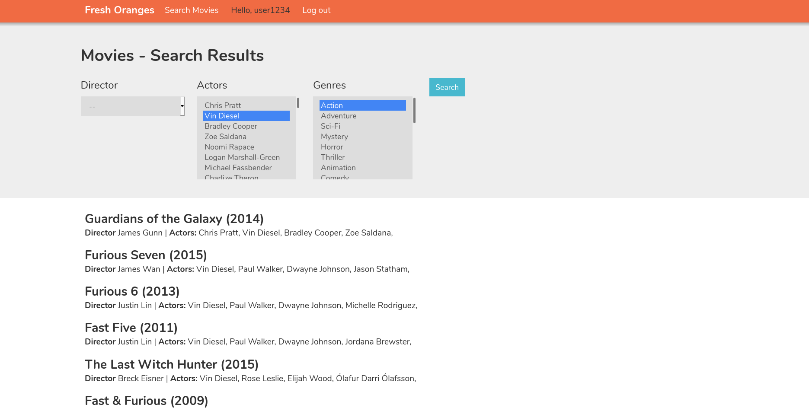
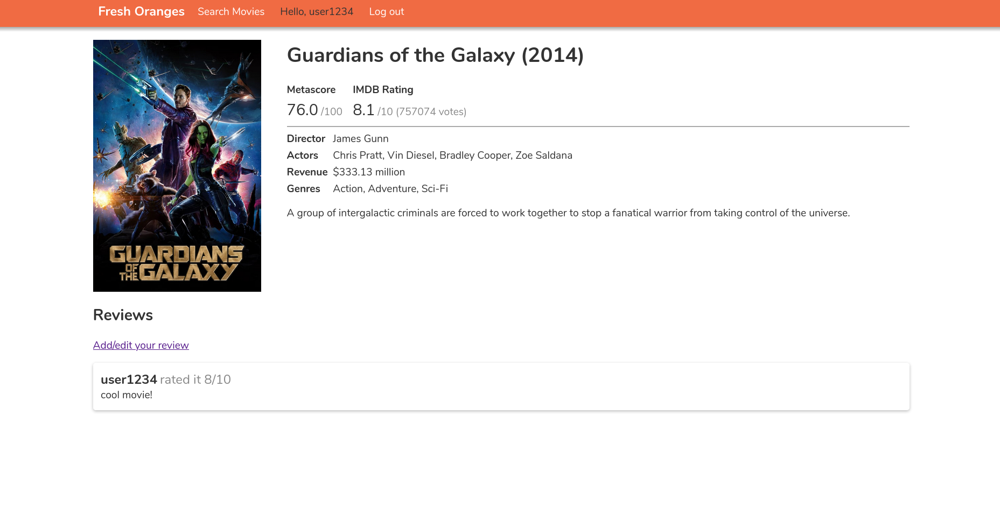

# CS235 (Fresh Oranges)
The Flask project for the 2020 S2 CompSci 235 practical assignment.

## Instructions (Linux)

Set up a new `settings.cfg` file for Flask config. The `TMDB_KEY` is required for fetching
image urls from [The Movie Database](https://www.themoviedb.org/).
The cfg file must also have a `SECRET_KEY`.

Create a new virtual environment to deploy:

```
python -m venv venv # must be python 3
source venv/bin/activate
pip install -r requirements.txt
python -m pytest
FLASK_DEBUG=1 CONFIG=settings.cfg python -m flask run
```
Note if `FLASK_DEBUG=1` (or `FLASK_ENV=development` which does the some thing), then there is a demo user with username `user1234` and
password `pass1234`, and the `SECRET_KEY` is TEST

## Screenshot
Home page

Single movie

